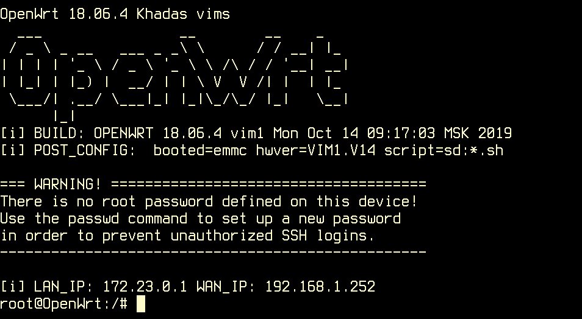

# khadas openwrt

openwrt for Khadas VIMs boards

## build from sources

## screenshots



## Images

+ https://github.com/hyphop/khadas-openwrt/releases/

## Installation

just write iamge to SD card

```
cd /tmp
wget https://github.com/hyphop/khadas-openwrt/releases/download/0.1/OPENWRT.vim1.vfat.img.gz
gzip -dc OPENWRT.vim1.vfat.img.gz | sudo dd bs=1M of=/dev/SD_PATH
sync
```

## docs

[files/docs](files/docs)

## how to ...

## related projects

+ https://github.com/hyphop/khadas-linux-kernel
+ https://github.com/hyphop/khadas-uboot-spi
+ https://github.com/hyphop/khadas-rescue

## links

+ https://github.com/khadas
+ https://docs.khadas.com
