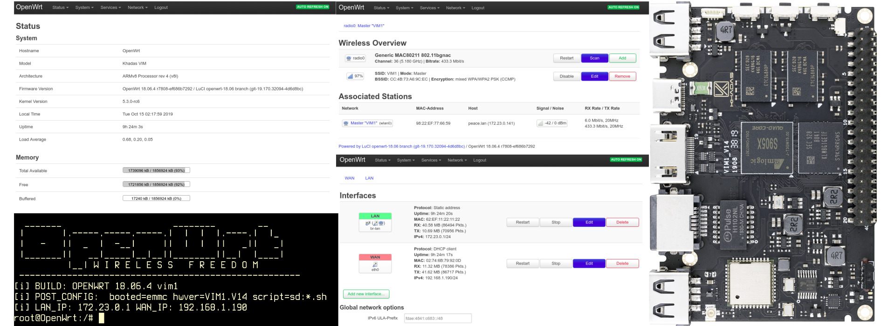

# khadas openwrt [](https://travis-ci.com/hyphop/khadas-openwrt)

openwrt for Khadas VIMs boards https://www.khadas.com/vim (Amlogic s905 s912 a311D s905d3 )



## Change logs

+ [README.changes.md](README.changes.md)

## supported Boards

+ khadas vim1 - OK
+ khadas vim2 - OK (wifi chip AP6356S 02D0:4356 OK)

## Build

```
git clone https://github.com/hyphop/khadas-openwrt.git
cd khadas-openwrt
# ./scripts/build_prepare
./scripts/build -1 # build openwrt for VIM1
...
./scripts/build -2 # build openwrt for VIM2

```

## Images

+ https://github.com/hyphop/khadas-openwrt/releases/
+ https://dl.khadas.com/Firmware/VIM1/OpenWrt
+ https://dl.khadas.com/Firmware/VIM2/OpenWrt
+ https://dl.khadas.com/Firmware/VIM3/OpenWrt - WIP
+ https://dl.khadas.com/Firmware/VIM3L/OpenWrt - WIP

## Installation

just write iamge to SD card

```
cd /tmp
wget https://github.com/hyphop/khadas-openwrt/releases/download/0.1/VIM1.OPENWRT.sd.img.gz || \
wget https://dl.khadas.com/Firmware/VIM1/OpenWrt/VIM1.OPENWRT.sd.img.gz
gzip -dc VIM1.OPENWRT.sd.img.gz | sudo dd bs=1M of=/dev/SD_PATH
sync
```

## install to emmc inside openwrt booted from sd

    root@openwrt:/# mmc_install_from_sd

## docs & how to

+ [files/docs](files/docs)
+ [README.openwrt.vims.md](README.openwrt.vims.md)

## related projects

+ https://github.com/hyphop/khadas-linux-kernel
+ https://github.com/hyphop/khadas-uboot-spi
+ https://github.com/hyphop/khadas-rescue

## links

+ https://openwrt.org/
+ https://www.khadas.com/vim
+ https://github.com/khadas
+ https://docs.khadas.com
